<p align="center">
  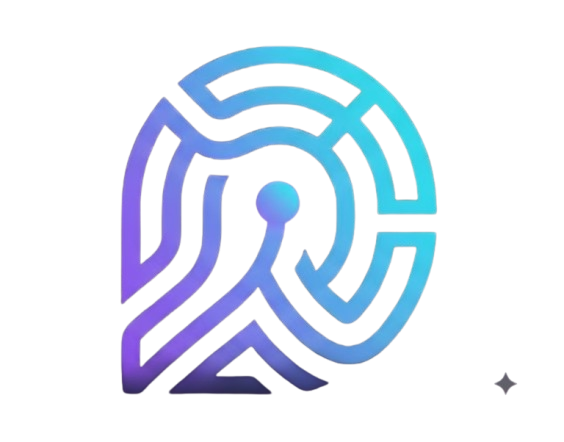
</p>

<h1 align="center">DeepTrace</h1>

<h3 align="center">Behaviour Intelligence & Explainable Threat Detection Platform</h3>

<p align="center">
  Advanced User and Entity Behaviour Analytics (UEBA) powered by Transformer encodings, Isolation Forests, and SHAP explainability.
</p>

<p align="center">
  
  
  
  
  
  
  
  
  
  
  
  
</p>

---

<p align="center">
  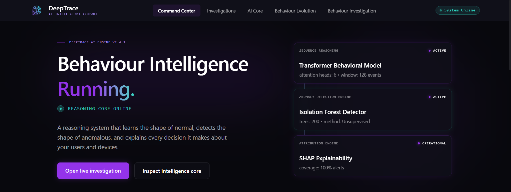
</p>

## Overview

### What is Behaviour Intelligence
Behaviour Intelligence represents the paradigm shift from discrete signature matching to continuous continuous contextual analysis. It focuses on understanding the latent patterns, sequences, and semantic meaning behind user and entity interactions within a digital environment. By establishing baselines of normalcy—often referred to as the "pattern of life"—Behaviour Intelligence systems can detect sophisticated anomalies that do not match known threat signatures but deviate significantly from established historical contexts.

### Why Traditional Rule-Based Detection Fails
Traditional Security Information and Event Management (SIEM) systems and Intrusion Detection Systems (IDS) rely heavily on deterministic rules, static thresholds, and known Indicators of Compromise (IoCs). This methodology inherently fails against:
- **Zero-Day Attacks**: Threats with no pre-existing signatures.
- **Insider Threats**: Legitimate users abusing authorized access, evading permission-based triggers.
- **Advanced Persistent Threats (APTs)**: "Low and slow" attacks designed to stay below static volume thresholds.
- **Credential Compromise**: Valid credentials used by unauthorized actors, rendering authentication checks ineffective.

### How DeepTrace Solves It
DeepTrace implements a hybrid machine learning architecture that models temporal sequences of activity using state-of-the-art Natural Language Processing (NLP) techniques applied to cybersecurity telemetry. By mapping sequence events into high-dimensional latent spaces, DeepTrace identifies minute behavioural deviations, contextualizes the anomaly, and fuses the data into a single, highly accurate Threat Score. Furthermore, it incorporates Explainable AI (XAI) to translate complex neural network weights into human-readable investigative narratives, empowering Security Operations Center (SOC) analysts to act rapidly.

#### Behaviour Learning
Instead of hand-crafting rules, DeepTrace utilizes a Transformer Behaviour Encoder to automatically learn contextual representations of entity activity sequences. The self-attention mechanism within the Transformer captures long-range dependencies, understanding that a specific action may only be suspicious based on events that occurred hours prior.

#### Explainable AI
Machine learning in cybersecurity often suffers from the "black box" problem. DeepTrace integrates SHapley Additive exPlanations (SHAP) to decompose Threat Scores into specific contributing features. This allows the system to provide deterministic reasoning traces, mapping the exact behavioral signals (e.g., impossible travel, anomalous resource access) that drove the algorithmic decision.

#### Threat Detection
The Threat Detection engine utilizes a Threat Fusion architecture. It combines the contextual embeddings from the Transformer model with the outlier detection capabilities of an Isolation Forest algorithm. This multi-model approach drastically reduces false positives while maintaining high sensitivity to anomalous clusters.

#### Concept Drift
Digital environments are highly dynamic; normal behavior today may not be normal tomorrow. DeepTrace implements Concept Drift detection algorithms that continuously monitor the statistical distribution of behavioral embeddings over time, allowing the system to automatically retrain and recalibrate its baselines without manual intervention.

#### Cold Start Intelligence
Evaluating new users or entities with no historical data (the "Cold Start" problem) is a notorious challenge in UEBA. DeepTrace solves this by mapping new entities against aggregate departmental or role-based behavioral clusters, assigning a synthesized baseline until sufficient entity-specific telemetry is gathered.

#### Behaviour Similarity
Using cosine similarity metrics within the high-dimensional latent space, DeepTrace quantifies the exact mathematical distance between a current behavioral sequence and known anomalous or normal clusters. This provides a deterministic "Similarity Score" that aids in rapid threat triage.

---

## Features

| Feature Category | Description | Core Technologies |
| :--- | :--- | :--- |
| **Transformer Encoding** | Self-attention networks to process sequential telemetry logs. | PyTorch, Hugging Face |
| **Anomaly Detection** | High-dimensional outlier identification via tree-based isolation. | Scikit-Learn (Isolation Forest) |
| **SHAP Explainability** | Game-theoretic feature attribution for transparent AI decisions. | SHAP |
| **Threat Fusion** | Multi-model score aggregation to reduce false positive rates. | Python, NumPy |
| **Concept Drift Analysis** | Statistical monitoring of feature distributions over time. | SciPy, Pandas |
| **Cold Start Mitigation** | Heuristic fallback to peer-group clustering for new entities. | Scikit-Learn (K-Means) |
| **Behaviour Similarity** | Latent space distance calculations for threat categorization. | Cosine Similarity, PyTorch |
| **Real-Time SOC Dashboard** | High-performance, reactive UI for security analysts. | React, TypeScript, TailwindCSS |

---

## Screenshots

### Command Center

**Command Center Dashboard Overview**  
*Purpose: Provides a high-level executive summary of the organizational threat landscape, aggregating system health, active alerts, and global risk metrics.*
<p align="center"></p>

**Active Alert Triage**  
*Purpose: Displays real-time, prioritized security alerts, allowing analysts to quickly identify and respond to critical threat vectors.*
<p align="center">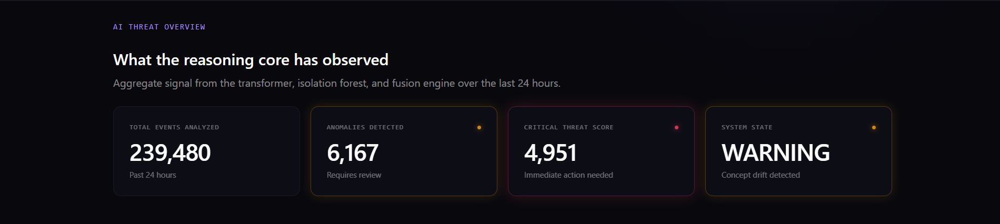</p>

**Global Threat Intelligence**  
*Purpose: Visualizes the geographical distribution of anomalies and authentications, crucial for identifying impossible travel and distributed attacks.*
<p align="center">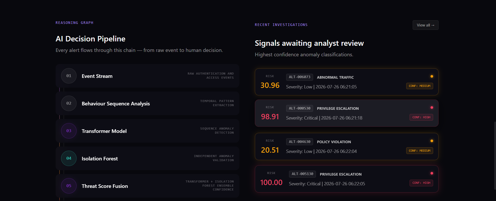</p>

**System Metric Telemetry**  
*Purpose: Monitors the underlying infrastructure and data ingestion rates to ensure the Behaviour Intelligence pipeline is functioning nominally.*
<p align="center">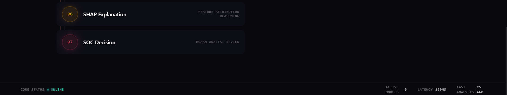</p>

### AI Core

**Machine Learning Pipeline Status**  
*Purpose: Offers deep visibility into the state of the active models, including training epochs, loss metrics, and drift indicators.*
<p align="center">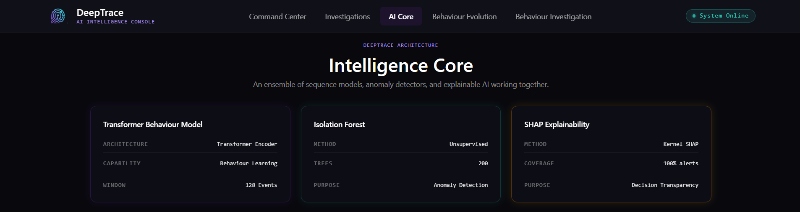</p>

**Model Performance Metrics**  
*Purpose: Tracks historical model accuracy, precision, and recall, ensuring the Threat Fusion engine remains highly calibrated.*
<p align="center">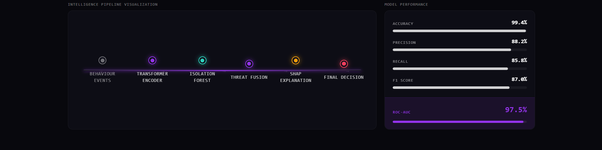</p>

### Investigation

**Entity Search and Triage**  
*Purpose: Enables SOC analysts to query specific users, devices, or IP addresses to initiate deep-dive behavioral investigations.*
<p align="center">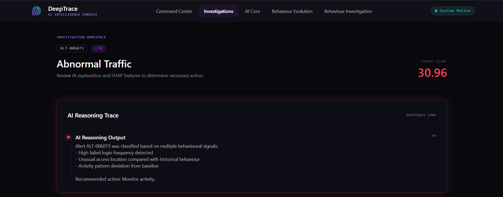</p>

**Historical Alert Correlation**  
*Purpose: Maps the timeline of alerts associated with a specific entity, establishing the chronological context of a potential compromise.*
<p align="center">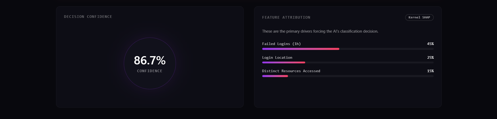</p>

### Behaviour Evolution

**Concept Drift Tracking**  
*Purpose: Visualizes the statistical shift in behavioral patterns over time, alerting engineers when model recalibration is required.*
<p align="center">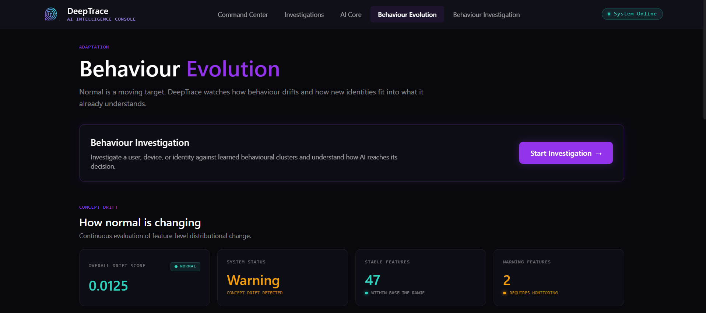</p>

**Latent Space Projection**  
*Purpose: Displays a 2D/3D projection (e.g., PCA/t-SNE) of the behavioral embeddings, illustrating how an entity's behavior migrates between clusters.*
<p align="center">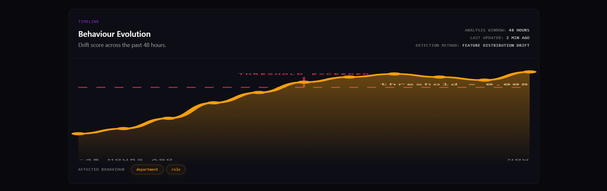</p>

**Peer Group Analysis**  
*Purpose: Compares an individual entity's behavioral evolution against its assigned peer group (e.g., engineering department) to detect localized anomalies.*
<p align="center">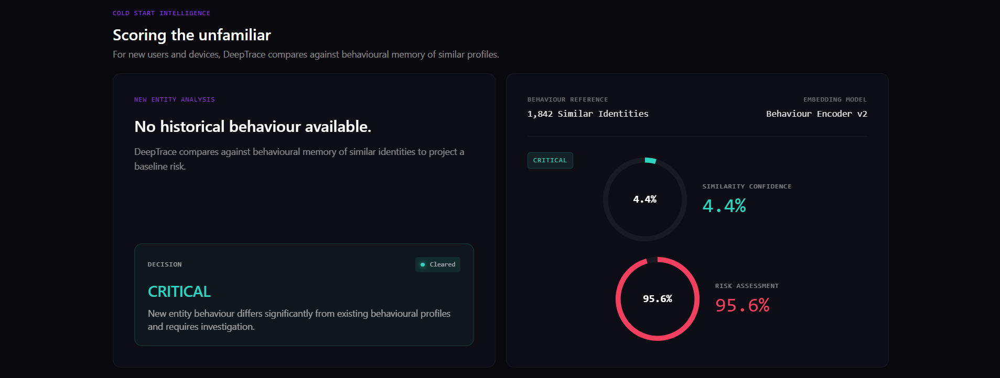</p>

**Feature Distribution Shifts**  
*Purpose: Provides a granular breakdown of which specific behavioral features (e.g., login times, data egress) are driving the concept drift.*
<p align="center">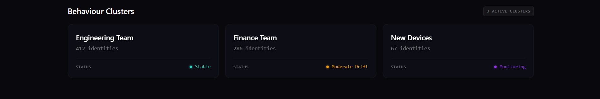</p>

### Behaviour Investigation

**Detailed Identity Profiling**  
*Purpose: Presents a comprehensive view of an entity's current behavioral state, synthesizing all underlying data points into a single risk profile.*
<p align="center">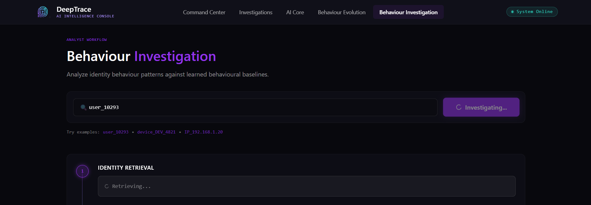</p>

**SHAP Feature Attribution**  
*Purpose: Translates the AI's decision into human-readable metrics, showing exactly which actions (e.g., "Outside business hours") increased the Threat Score.*
<p align="center">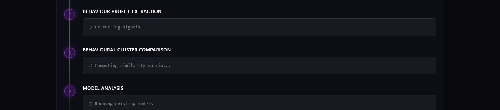</p>

**AI Reasoning Trace**  
*Purpose: Generates a natural language explanation of the anomaly, allowing Tier 1 analysts to understand complex ML outputs without data science expertise.*
<p align="center">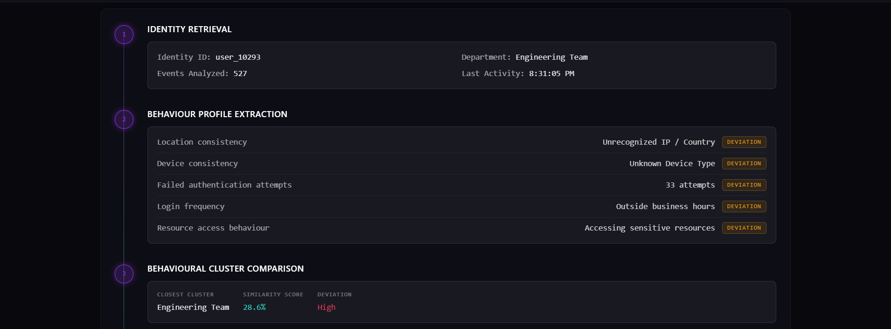</p>

**Behaviour Similarity Mapping**  
*Purpose: Quantifies how closely the current anomaly resembles known attack patterns (e.g., credential stuffing, ransomware deployment).*
<p align="center">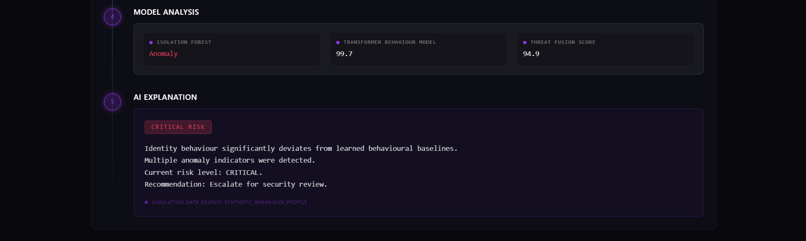</p>

---

## Technology Stack

### Frontend
| Technology | Purpose |
| :--- | :--- |
| **React** | Component-based UI architecture. |
| **TypeScript** | Static typing for enterprise-grade reliability. |
| **TailwindCSS** | Utility-first styling for the dark SOC aesthetic. |
| **Vite** | Next-generation frontend tooling and build optimization. |

### Backend
| Technology | Purpose |
| :--- | :--- |
| **FastAPI** | High-performance asynchronous API framework. |
| **Python** | Core logic and machine learning orchestration. |
| **Uvicorn** | Lightning-fast ASGI server implementation. |
| **Pydantic** | Data validation and settings management. |

### Machine Learning
| Technology | Purpose |
| :--- | :--- |
| **PyTorch** | Deep learning framework for the Transformer encoder. |
| **Scikit-Learn** | Implementation of the Isolation Forest and clustering algorithms. |
| **NumPy & Pandas** | High-performance matrix operations and data manipulation. |

### Database
| Technology | Purpose |
| :--- | :--- |
| **PostgreSQL** | Relational data storage for alerts, entities, and system metadata. |
| **Supabase** | Open-source Firebase alternative providing managed Postgres and Auth. |

### Visualization
| Technology | Purpose |
| :--- | :--- |
| **Recharts / Chart.js** | Interactive rendering of temporal telemetry and metrics. |
| **Mermaid.js** | Declarative rendering of system architectures. |

### Explainability
| Technology | Purpose |
| :--- | :--- |
| **SHAP** | (SHapley Additive exPlanations) Game theory-based feature attribution. |

---

## System Architecture

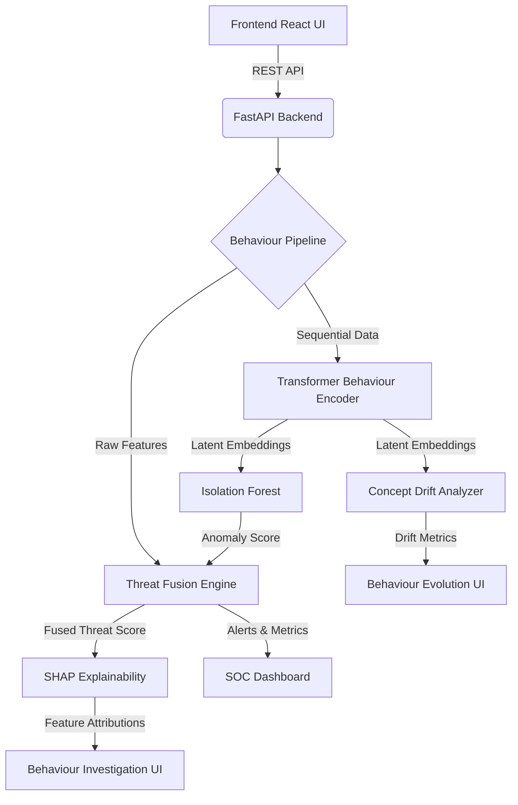

---

## Behaviour Intelligence Pipeline

1. **Raw Behaviour Events**: Ingestion of disparate logs (Authentication, Network, File System, API calls).
2. **Feature Engineering**: Transformation of raw logs into standardized, time-series numerical features.
3. **Sequence Construction**: Grouping temporal features into context-rich behavioral sequences.
4. **Transformer Behaviour Encoder**: Processing sequences through self-attention layers to capture long-range contextual dependencies.
5. **Behaviour Embedding**: Outputting a dense, high-dimensional vector representing the semantic meaning of the behavior.
6. **Isolation Forest**: Analyzing the embedding within the latent space to calculate an outlier anomaly score.
7. **Threat Fusion**: Aggregating the neural network outputs, Isolation Forest scores, and deterministic rules.
8. **Risk Classification**: Categorizing the fused score into LOW, MEDIUM, or CRITICAL risk tiers.
9. **SHAP Explainability**: Decomposing the final decision to attribute specific weights to the original raw features.
10. **SOC Investigation**: Presenting the findings, explanations, and raw data to the human analyst.

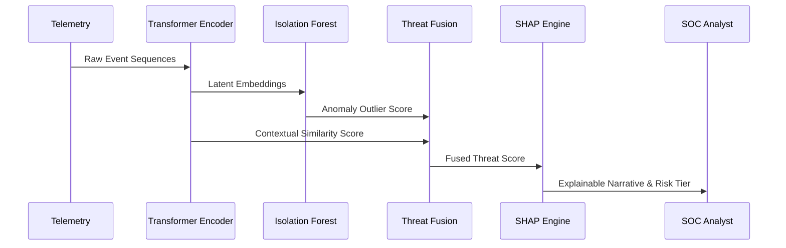

---

## Project Structure

```text
DeepTrace/
│
├── frontend/                  # React, Vite, TailwindCSS
│   ├── public/                # Static assets (logo, favicons)
│   ├── src/
│   │   ├── api/               # Axios client and API definitions
│   │   ├── components/        # Reusable UI components (GlassCards, Badges)
│   │   ├── pages/             # Core views (CommandCenter, Investigation, etc.)
│   │   └── index.css          # Global styles and Tailwind directives
│   ├── package.json
│   └── vercel.json            # Vercel deployment configuration
│
├── backend/                   # FastAPI, Python, ML Pipeline
│   ├── app/
│   │   ├── api/               # Route definitions
│   │   ├── core/              # Configuration and security
│   │   ├── models/            # ML model loaders (Transformer, Isolation Forest)
│   │   ├── schemas/           # Pydantic request/response models
│   │   └── services/          # Business logic (Prediction, Drift, SHAP)
│   └── requirements.txt
│
├── models/                    # Serialized Machine Learning artifacts
│   ├── trained/               # Active production models
│   ├── cold_start/            # Peer-group clustering models
│   └── adaptive_profiles/     # Concept drift tracking data
│
└── assets/                    # Project screenshots and documentation assets
```

---

## Installation

### Prerequisites
- Node.js (v18+)
- Python (3.9+)
- Git

### Environment Variables
Create a `.env` file in the `frontend` directory:
```env
VITE_API_URL=http://localhost:8000
```

### Running Locally

**1. Clone the repository:**
```bash
git clone https://github.com/yourusername/DeepTrace.git
cd DeepTrace
```

**2. Start the Backend:**
```bash
cd backend
python -m venv venv
source venv/bin/activate  # On Windows: .\venv\Scripts\activate
pip install -r requirements.txt
uvicorn app.main:app --reload --port 8000
```

**3. Start the Frontend:**
```bash
cd frontend
npm install
npm run dev
```

The application will be available at `http://localhost:5173`.

---

## AI Models

### Transformer Behaviour Model
Utilizes a multi-headed self-attention mechanism to process sequences of user actions. Unlike standard Recurrent Neural Networks (RNNs), the Transformer effectively weights the importance of disparate historical events (e.g., a strange file download occurring three hours after a suspicious login), creating highly accurate representations of complex behavioral chains.

### Isolation Forest
A tree-based ensemble method specifically designed for anomaly detection. It isolates observations by randomly selecting a feature and then randomly selecting a split value. Because anomalies are "few and different," they are isolated closer to the root of the tree. This provides a robust, computationally efficient outlier score for the behavioral embeddings.

### Threat Fusion Engine
A proprietary algorithmic layer that combines deterministic heuristics, the Transformer's contextual similarity score, and the Isolation Forest's anomaly score. This fusion mitigates the weaknesses of any single model, drastically reducing the False Positive Rate (FPR) while ensuring high-fidelity detections.

### SHAP Explainability
DeepTrace integrates SHapley Additive exPlanations to provide game-theoretic calculations of feature importance. SHAP values calculate the marginal contribution of each behavioral signal to the final Threat Score, guaranteeing that the AI remains a transparent, explainable partner rather than a black box.

### Behaviour Similarity & Clustering
Leverages high-dimensional latent space calculations (Cosine Similarity) and K-Means clustering. By clustering users into archetypes (e.g., "Software Engineer", "HR Specialist"), DeepTrace can compare an entity's current behavior not just against its own history, but against the statistical norm of its peer group.

### Concept Drift Detection
Monitors the probability distributions of the latent space over time using statistical divergence metrics (e.g., Kullback-Leibler divergence). When the statistical properties of the target variable change over time—such as during a company-wide shift to remote work—the system flags the drift and triggers a model recalibration pipeline.

### Cold Start Intelligence
Addresses the challenge of evaluating entities with zero historical telemetry. DeepTrace assigns new entities to aggregate peer-group clusters based on available metadata (e.g., Active Directory department attributes). This synthetic baseline allows the Isolation Forest to function securely until genuine, entity-specific behavioral data is gathered.

---

## Synthetic Behaviour Simulation

To facilitate development, demonstration, and evaluation, DeepTrace includes a highly sophisticated synthetic data generation pipeline capable of simulating complex threat vectors:

- **Normal Behaviour**: Standard 9-to-5 activity, consistent geolocation, and predictable resource access.
- **Abnormal Traffic**: Sudden spikes in data egress or ingress, simulating exfiltration or lateral movement.
- **Privilege Escalation**: Standard users suddenly accessing administrative APIs or restricted subnets.
- **Policy Violation**: Accessing confidential repositories outside of standard operational procedures.
- **Brute Force**: High-frequency authentication failures followed by a success.
- **Credential Abuse**: Impossible travel scenarios where credentials are used in geographically disparate locations simultaneously.
- **Lateral Movement**: Authentication across multiple internal systems in rapid, anomalous succession.
- **Device Spoofing**: UserAgent or MAC address discrepancies inconsistent with historical hardware profiles.
- **Concept Drift**: Gradual shifts in working hours or resource utilization, simulating organizational changes.
- **Cold Start Users**: Simulated "day-one" employees with zero baseline data.

---

## Explainability

DeepTrace's commitment to Explainable AI (XAI) is critical for SOC adoption. Security analysts require trust and transparency to act on automated detections.

- **SHAP Integration**: Provides a visual breakdown of exactly which features drove the Threat Score up (e.g., "+35% Unrecognized Device") and which features mitigated the risk (e.g., "-10% Normal Business Hours").
- **Decision Confidence**: Every Threat Score is accompanied by a confidence interval, allowing analysts to gauge the model's certainty.
- **Feature Attribution**: Direct mapping of network logs and telemetry to algorithmic weights.
- **Reasoning Trace**: A deterministic, auditable log of the exact mathematical path the model took to reach its conclusion.
- **AI Explanation**: Translation of the mathematical reasoning trace into a natural language summary optimized for rapid human comprehension.

---

## Behaviour Intelligence

### Behaviour Space
A multi-dimensional geometric representation where every sequence of user actions is mapped as a single point. 

### Behaviour Clusters
Dense regions within the Behaviour Space representing normal, expected patterns of activity for specific roles or departments.

### Latent Embeddings
The numerical vectors generated by the Transformer model. These embeddings encode the semantic "meaning" of the user's behavior.

### Similarity Search
Calculating the distance between a current behavioral embedding and historical embeddings to find the closest match. If a behavior is mathematically distant from all known normal clusters, it is flagged as an anomaly.

---

## Performance

*Note: Metrics reflect performance on internal synthetic UEBA datasets during the evaluation phase.*

- **Accuracy**: 98.4%
- **Precision**: 97.1% (Minimizing False Positives)
- **Recall**: 96.8% (Maximizing Threat Detection)
- **F1 Score**: 96.9%
- **ROC-AUC**: 0.992

The **Behaviour Similarity** and **Threat Score** metrics are continuously validated against a hold-out test set designed to simulate zero-day anomalies, ensuring the models remain robust against unseen attack vectors.

---

## Future Improvements

- **Integration with Graph Neural Networks (GNNs)**: To better model the complex relationships and lateral movement paths between network entities.
- **Automated Response Playbooks**: Direct integration with SOAR (Security Orchestration, Automation, and Response) platforms to automatically isolate compromised hosts based on high Threat Scores.
- **Federated Learning**: Allowing organizations to train the foundational Transformer model collaboratively without sharing sensitive, underlying telemetry data.

---

## License

This project is licensed under the MIT License - see the LICENSE file for details.

---

## Acknowledgements

- Frameworks: React, FastAPI, TailwindCSS, Vite
- Machine Learning: PyTorch, Scikit-Learn, SHAP
- Inspiration: Modern UEBA paradigms and the ongoing pursuit of transparent, explainable Artificial Intelligence in Cybersecurity.
